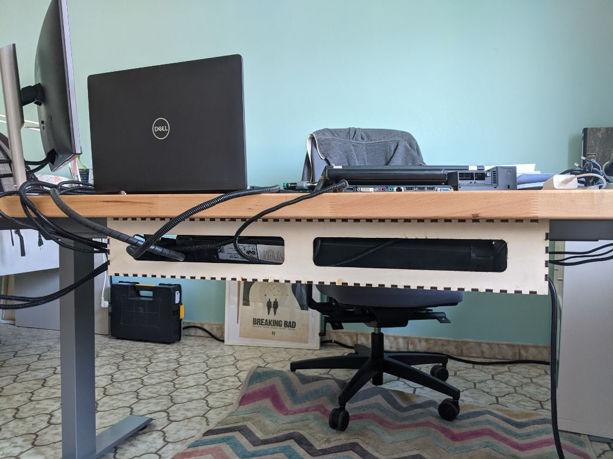

# Cable Channel Laser-cut model

A simple laser cut cable channel model for your lasercutter. This model is designed for 5mm thick wood panels and fits perfectly under your table.

The original box was made with boxes.py https://www.festi.info/boxes.py/.

Mounted under your table with some screws:

If you need more space, just add two of the boxes:

Version 2 now has bigger holes and you can use a normal screwdriver though the bigger holes in the bottom-part.

### Copyright and Authorship

- Lasercut-Parts: [CC-BY-SA 4.0](https://creativecommons.org/licenses/by-sa/4.0/) -  @ [Timo Schindler](https://www.timoschindler.de)
